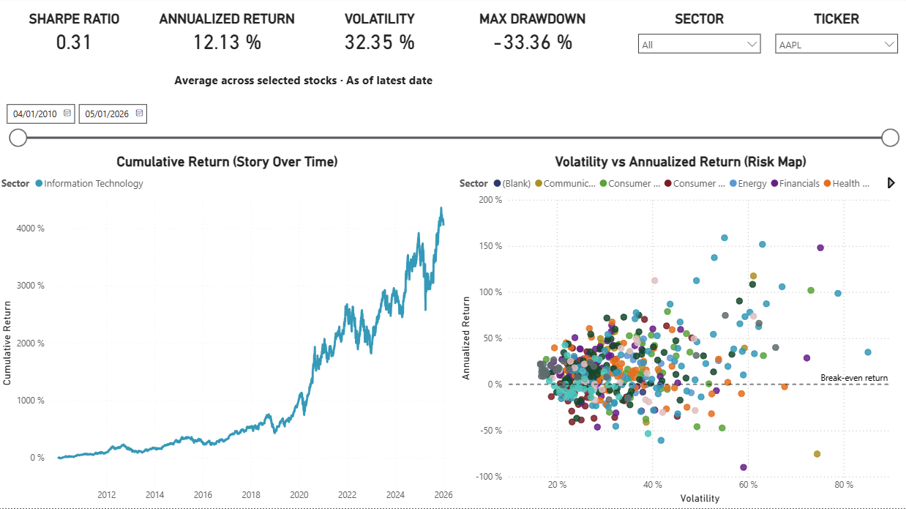
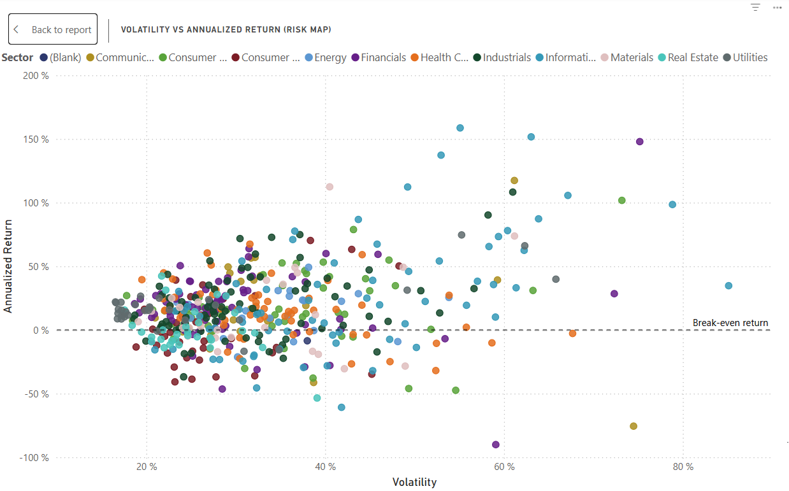
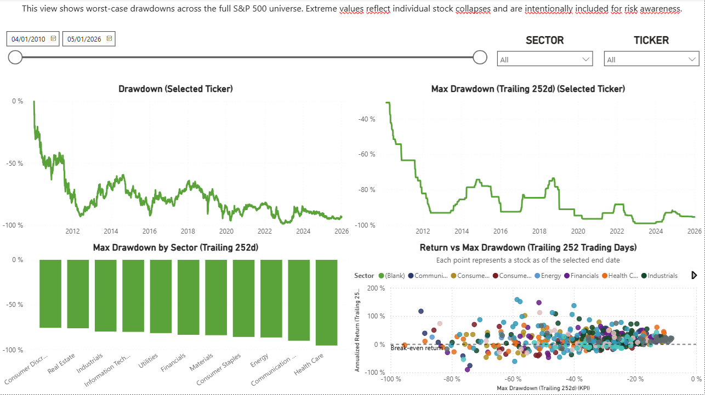
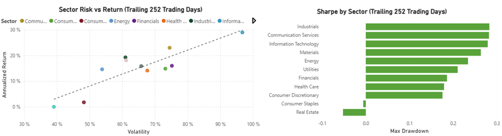

# S&P 500 Stock Performance Analysis (2010–2026)



> An end-to-end Power BI analytics project on 16 years of S&P 500 daily prices (~1.9M rows, ~500 stocks). Hybrid Python + DAX architecture, finance-grade risk metrics (Sharpe, drawdowns), and a Python validation suite that makes every dashboard figure auditable from the underlying fact table.

**Interactive Power BI Dashboard for Risk-Aware Portfolio Analysis**

## Business Context
Retail investors often struggle with overwhelming market data when building portfolios. This project analyzes historical S&P 500 stock performance to provide actionable insights on returns, risk, and diversification.

The analysis is structured across three layers — performance, risk stress, and sector stability — mirroring how investment decisions are evaluated in practice.

**Business Problem:** How can we help retail investors identify strong-performing stocks and sectors while managing risk using historical price data?

**Key Questions Answered:**
- Which stocks/sectors delivered the highest risk-adjusted returns?
- How did performance vary during major events (e.g., 2020 COVID crash, 2022 inflation, recent 2025-2026 rallies)?
- What correlations exist to support better diversification?
- Metrics such as the Sharpe ratio (risk-adjusted returns, annualized volatility as denominator) are used to contextualize performance rather than as strict investment recommendations.

## Data Sources & Limitations

- **Primary Source:** [Kaggle - S&P 500 Daily Update Dataset](https://www.kaggle.com/datasets/yash16jr/s-and-p500-daily-update-dataset)  
  Daily Open, High, Close, Low, Volume data for ~500 stocks, 2010-01-04 to 2026-01-05 (wide format).

- **Enrichment:** Sector mapping from [Wikipedia List of S&P 500 companies](https://en.wikipedia.org/wiki/List_of_S%26P_500_companies) (GICS classifications, current as of Jan 6, 2026). Local copy: [sp500_sectors.csv](data/raw/sp500_sectors.csv).

- **Limitations:** 
  - No Adjusted Close (returns exclude dividends/splits—common approximation for price-based analysis).
  - Static sector assignments (no point-in-time changes for historical additions/removals)
  - Static snapshot (as of download date).
  - This analysis reflects historical data available up to the download date and does not update automatically.
  
(See `/docs/` for data dictionary and full assumptions.)

## Data Preparation & ETL Process

The raw dataset was a wide-format CSV (~150 MB) with ~2516 columns containing daily OHLCV data for ~503 S&P 500 stocks from 2010-01-04 to 2026-01-05. The data was grouped by metric (all Closes together, then all Highs, etc.) with multi-row headers, requiring significant transformation.

**Key Challenges & Solutions**
- Multi-row headers & grouped columns → Used transpose to flip the structure, making metric groups vertical and easier to handle.
- Missing or inconsistent metadata → Filled down PriceType ("Close", "High", "Low", "Open", "Volume") and Ticker labels using Power Query Fill Down.
- Performance & crashes with large wide data → Avoided manual column selection; used transpose + targeted filtering and verification steps.
- Validation → Manually checked group sizes (503 rows per metric) and specific ticker/date combinations (e.g., AAPL on 19/01/2010, AMZN on 14/01/2010, ABT on 22/01/2010) — each returned exactly one row with all five metrics (Open, High, Low, Close, Volume) after final pivot.

**Final Fact Table (Fact_StockPrices)**
- Grain: One row per Date + Ticker
- Columns: Date, Ticker, Open, High, Low, Close, Volume
- Row count: 1,903,495 (after pivot; ~6% missing rows due to delistings/gaps — normal for historical data)
- Transformation performed entirely in Power Query (ETL layer) before loading to the model.
- This ensured the analytical model operated on a clean, validated grain before any calculations or feature engineering were applied.

This process mirrors real-world ETL for financial datasets — handling messy exports, verifying integrity, and documenting decisions.

**Major Power Query Steps (Chronological)**
1. Imported raw CSV without promoting headers  
2. Transposed table to make metric groups vertical  
3. Promoted dates as column headers  
4. Filled down PriceType and Ticker labels  
5. Removed junk rows/columns (e.g., empty "Date" column)  
6. Unpivoted date columns to long format for verification  
7. Pivoted PriceType back to wide format (Open, High, Low, Close, Volume)  
8. Verified grain with spot-checks on specific tickers/dates

Current state: Fact table loaded in wide format (1.9M rows), ready for star schema and DAX measures.

## Methodology & Tools
- **ETL & Cleaning:** Power Query (unpivot wide → long format, date handling)
- **Data Modeling:** Star schema in Power BI
- **Calculations:** Hybrid approach — DAX for aggregations and ratios (e.g., cumulative returns, Sharpe ratio), Python for heavy rolling statistics (e.g., 252-day volatility, rolling drawdowns)
- **Visualization:** Interactive dashboard for exploration and simple portfolio simulation

## Data Model & Relationships

The Power BI model is a star schema built on the cleaned fact table:

- **Fact table:** `Fact_StockPrices` (1,903,495 rows)
  - Grain: one row per trading date + ticker
  - Columns: Date, Ticker, Open, High, Low, Close, Volume, plus engineered columns (Trading Day Index, Daily Return %) and Python-precomputed features (Volatility 252d, Drawdown, Max Drawdown 252d)
- **Date dimension:** continuous trading-day table enabling time-intelligence (year-over-year returns, rolling windows, period-over-period comparisons)
- **Stock/Sector dimension:** sourced from `data/raw/sp500_sectors.csv` (Ticker → Sector / Industry / Company Name), enabling sector-based slicing and aggregation

Relationships are one-to-many from each dimension to the fact, with single-direction filtering — the standard pattern for BI semantic models.

### Daily Return Calculation (Production-Grade Workaround)

**Challenge**  
Measure-based daily returns failed due to filter context and memory issues on 1.9M rows.

**Solution**  
Used calculated columns (computed at refresh time) for:
1. **Trading Day Index** — sequential rank per ticker (RANKX + FILTER + EARLIER)
2. **Daily Return %** — LOOKUPVALUE to previous index's Close

**Advantages**
- Handles weekends, holidays, delistings automatically
- Computed once at refresh — zero runtime performance impact
- Works under any slicer/filter

**Trade-offs**
- Uses more model memory (two new columns)
- Static (doesn't dynamically respond to visual filters — but correct for financial analysis)

This is the standard pattern in financial analytics when measures become too slow.

## Rolling Volatility Optimization (Python Preprocessing)

### Challenge
Computing rolling 252-day volatility directly in Power BI using a DAX calculated column proved computationally expensive.  
On a ~1.9M-row fact table, row-by-row window calculations significantly increased refresh time and impacted overall model responsiveness.

### Design Decision
To ensure fast refreshes and responsive visuals, rolling volatility was precomputed in Python (script: build_volatility_252d.py) and imported as a static column. This follows common practice of moving heavy statistical feature engineering upstream of the BI layer.

This approach follows common analytical best practices:
- Heavy, row-level statistical computations → upstream (Python)
- Semantic modeling and aggregation → Power BI
- Python (pandas/numpy) → ideal for vectorized rolling window operations on large tabular data

### Implementation
1. The fully transformed fact table was exported once from the Power BI model (via DAX Studio).
2. A Python script (`build_volatility_252d.py`) computed:
   - Rolling 252-day standard deviation per ticker
   - `min_periods = 30` guardrail
   - Annualization using √252
   - Population standard deviation (`ddof = 0`) to match financial conventions.
3. The enriched dataset was re-imported into Power BI as the primary fact table.
4. The original DAX-based volatility column was removed.

### Results
- **Refresh time reduced from several minutes to seconds**
- **Improved report responsiveness**
- Cleaner semantic layer (no complex rolling DAX logic)
- Identical analytical results with far better performance

**Performance Summary**
- Dataset size: ~1.9M rows
- DAX rolling volatility refresh time: several minutes
- Python-precomputed volatility refresh time: seconds

### Trade-offs
- Volatility values are static between refreshes (acceptable for historical analysis)
- Requires re-running the Python script for new data
- Cleaner semantic layer and faster Power BI performance

This refactor mirrors real-world analytics pipelines, where feature engineering is performed outside the BI layer to ensure scalability and maintainability. This separation of concerns aligns with production analytics patterns, where BI tools serve the semantic layer rather than the computational engine.

## Risk-Adjusted Performance Metrics (Sharpe Ratio Design)

### Objective
To provide **finance-grade, interactive risk-adjusted performance metrics** without sacrificing Power BI performance on a ~1.9M row dataset.

The Sharpe Ratio was selected as the primary risk-adjusted metric to contextualize returns relative to volatility, using a trailing 252-trading-day window.

### Sharpe Ratio Definition (Trailing 252 Days)

The Sharpe Ratio is defined as:

Sharpe Ratio =  
( Annualized Return − Risk-Free Rate ) ÷ Annualized Volatility

Sharpe Ratio Interpretation (rough guide)
< 0      → Underperformed risk-free rate
0 – 1    → Acceptable
1 – 2    → Good
> 2      → Excellent

Where:
- **Annualized Return** = mean daily return × 252  
- **Volatility** = precomputed rolling 252-day annualized standard deviation  
- **Risk-Free Rate** = 2% annually (static assumption, approximating long-term 10Y Treasury averages over the analysis period)

This formulation aligns with standard portfolio monitoring practices and avoids compounding edge cases common in short rolling windows.

### Design Challenge: Performance vs Interactivity

Initial attempts to compute rolling Sharpe ratios entirely in DAX resulted in:
- Excessive evaluation time when used at daily granularity
- Poor responsiveness in visuals
- Risk of incorrect results under complex filter contexts

This led to a **hybrid design decision**:
- Rolling statistical components required by risk metrics (e.g., 252-day volatility) → Python preprocessing  
- Context-aware ratios and portfolio-level metrics (e.g., Sharpe Ratio) → DAX measures

Although the Sharpe Ratio itself is calculated in DAX, one of its core inputs — rolling 252-day volatility — is precomputed in Python. This separation ensures that computationally expensive rolling statistics are handled upstream, while Power BI remains focused on semantic modeling and interactivity.

### Scenario-Specific Measure Design (Key Architectural Decision)

Rather than using a single generic Sharpe measure everywhere, **two scenario-optimized measures were intentionally designed**:

#### 1. Sharpe Ratio (Trailing 252d) [KPI]
**Purpose:**  
> “As of the selected date, how strong is the stock’s risk-adjusted performance?”

**Used in:**
- KPI cards
- Ticker-level tables
- Risk vs Return scatter plots

**Design characteristics:**
- Anchored to the **last visible calendar date**
- Maps calendar dates to the **last available trading day**
- Evaluated once per entity (fast)
- Enforces a full 252-trading-day history requirement
- Includes safeguards against near-zero volatility values

This ensures the Sharpe Ratio behaves as a true **as-of financial KPI**, not a row-level calculation.

#### 2. Sharpe Ratio (Trailing 252d) [Series]
**Purpose:**  
> “How did risk-adjusted performance evolve over time?”

**Used in:**
- Line charts with DateDim[Date] on the X-axis

**Design characteristics:**
- Recomputed **per axis date**
- Uses the most recent trading day ≤ axis date
- Produces a smooth, interpretable historical Sharpe curve
- Prevents distortion from weekends, holidays, or missing trading days

### Why Separate Measures (Even with Identical Math)?

Although both measures share the same mathematical definition, they answer **different analytical questions**:

| Scenario | Question Being Answered | Optimal Design |
|--------|------------------------|----------------|
| KPI / Card | “What is the Sharpe ratio right now?” | Single as-of evaluation |
| Time Series | “How did Sharpe change over time?” | Axis-aware per-date evaluation |

Separating measures:
- Prevents accidental misuse across visuals
- Improves performance predictability
- Makes intent explicit to future readers and collaborators
- Mirrors real-world semantic modeling practices

> Measures are treated as **answers to specific business questions**, not just reusable formulas.

### Guardrails for Financial Correctness

To ensure stable and interpretable results:
- Sharpe Ratio is **blank until ≥252 trading days exist**
- Volatility values below a small threshold are excluded to prevent ratio blow-ups
- All calculations respect trading-day indexing rather than calendar days
- Risk-free rate fixed at 2% (approximate 10-year Treasury average 2010–2026)

These safeguards prevent misleading early-period or low-liquidity artifacts.

### Outcome

- Fully slicer-aware Sharpe Ratio
- Correct behavior under DateDim or Ticker filtering
- Fast visuals even on large datasets
- Clear separation between statistical computation and semantic logic
- Together with drawdown metrics, the dashboard provides a balanced view of return efficiency, variability, and downside risk.

This approach reflects **production-grade financial analytics design**, balancing correctness, performance, and interpretability through **defensive semantic modeling** — where measures are intentionally scoped and named based on their analytical purpose.

## Drawdown Analysis (Capital Risk Perspective)

While volatility and Sharpe Ratio describe *return variability* and *risk-adjusted efficiency*, they do not fully capture the **severity of capital losses** an investor may experience.

To address this, drawdown metrics were introduced.

### Drawdown Definitions

- **Daily Drawdown**  
  Measures the percentage decline from the most recent peak closing price:

  Drawdown = ( Close / Running Peak Close ) − 1

- **Max Drawdown (Trailing 252d)**  
  The worst peak-to-trough loss observed over the last 252 trading days.

Drawdowns are computed using **closing prices**, consistent with standard portfolio valuation and performance reporting practices.

### Design Rationale

- Closing prices reflect end-of-day portfolio valuation (NAV-style analysis)
- Avoids overstating risk due to intraday price spikes
- Maintains consistency with return and volatility calculations used in Sharpe Ratio

Intraday extremes (e.g., daily lows) are more relevant for execution and stop-loss analysis and were intentionally excluded from the primary drawdown metric to preserve semantic consistency.

### Implementation

Drawdown calculations were performed in Python to efficiently compute:

- Running peak prices per ticker
- Daily drawdown series
- Rolling 252-day maximum drawdown

This approach avoids expensive row-by-row window calculations in DAX while enabling fast, slicer-aware visualization in Power BI.

### Outcome

- Max Drawdown behaves as a **stepwise series**, updating only when:
  - A new worse drawdown occurs, or
  - The previous worst drawdown rolls out of the 252-day window
- Values are always ≤ 0 and interpretable as capital loss percentages
- Complements Sharpe and Volatility to form a complete risk profile

## Key Insights

Across the 2010–2026 period, sector-level patterns reveal that **higher risk is rewarded, but unevenly**:

- **Information Technology** delivered the highest annualized returns over the period, paired with the highest volatility — a structurally high-risk / high-reward profile. Suitable for growth-oriented allocations, but with explicit acceptance of larger drawdowns.
- **Communication Services** showed a more balanced risk–return trade-off, with competitive returns at relatively lower volatility. Often the better Sharpe-ratio choice for risk-aware portfolios.
- Some sectors with moderate returns still experienced **disproportionately deep drawdowns**, confirming that volatility and Sharpe ratio alone do not capture capital-loss severity. Drawdown analysis is a non-optional layer of risk diagnostics.
- The Sharpe-ratio leaderboard is **not the same as the cumulative-return leaderboard** — sectors that compound steadily without large drawdowns rank higher on risk-adjusted performance, which is what matters for portfolio construction.

The takeaway: diversification across risk profiles matters more than chasing the highest-return sector, and downside risk metrics (drawdowns) are necessary complements to volatility-based metrics (Sharpe).

## Dashboard Overview

The Power BI report is structured into **three analytical layers**, each designed to answer a specific investment question.

### Page 1 — Performance Overview


This page provides a high-level snapshot of performance and risk, allowing users to quickly assess returns, volatility, drawdowns, and risk-adjusted efficiency under dynamic filters.

### Page 1 — Risk vs Return (Stock-Level)


This scatter highlights the trade-off between annualized return and volatility at the stock level, with a break-even (0%) return reference line to separate value-creating from value-destroying investments.

This page answers:
> “How did the selected stocks or sectors perform, and how risky were they?”

**Key elements:**
- KPIs (as of selected end date):
  - Sharpe Ratio (Trailing 252d)
  - Annualized Return (Trailing 252d)
  - Volatility (Trailing 252d)
  - Max Drawdown (Trailing 252d)
- Cumulative Return (Selected Range) time series
- Risk vs Return scatter (Volatility vs Annualized Return)

This page is designed for **fast executive understanding** and initial exploration.

### Page 2 — Drawdowns & Risk Stress


This view focuses on capital risk, showing both daily drawdowns and rolling maximum drawdowns to capture downside severity and recovery dynamics.

This page answers:
> “How bad could losses get, and when did they occur?”

**Key elements:**
- Drawdown over time (close-to-close)
- Rolling Max Drawdown (Trailing 252d)
- Max Drawdown by Sector
- Return vs Max Drawdown scatter

This page highlights **path-dependent risk** that volatility and Sharpe alone cannot capture.

### Page 3 — Sector Risk, Return & Sharpe


This page aggregates performance at the sector level to support allocation decisions, combining risk–return positioning with Sharpe Ratio rankings.

This page answers:
> “Which sectors historically offered better trade-offs between return, risk, and downside?”

**Key elements:**
- Sector Risk vs Return scatter:
  - X-axis: Volatility (Trailing 252d)
  - Y-axis: Annualized Return (Trailing 252d)
  - Trend line highlighting the overall risk–return relationship
- Sharpe Ratio by Sector:
  - Ranks sectors by risk-adjusted performance
- Sector summary table:
  - Annualized Return
  - Volatility
  - Sharpe Ratio
  - Max Drawdown
 
### Observed Patterns (Illustrative, Not Exhaustive)

Across the analyzed period and at the sector level:

- **Information Technology** exhibits the highest volatility but also the highest annualized returns, reflecting a structurally high-risk / high-reward profile.
- **Communication Services** shows a more balanced risk–return trade-off, offering competitive returns with relatively lower volatility.
- Some sectors with moderate returns still experience disproportionately deep drawdowns, highlighting that volatility alone does not capture capital risk.

These observations reinforce that higher risk can be rewarded, but not uniformly across sectors, emphasizing the importance of diversification and downside awareness.

This page synthesizes performance and risk metrics into **actionable sector-level insights**, supporting allocation decisions rather than stock picking.

> **Note on Dashboard Access**  
> Due to tenant-level Power BI restrictions, public embedding is disabled.  
> The report and dashboard are available as a `.pbix` file in this repository and were published to Power BI Service for validation.  
> Screenshots and full documentation are provided to demonstrate functionality and design.

## Power BI Service Deployment

To complete the full analytics lifecycle, the dashboard was published to **Power BI Service**.

**Deployment details:**
- Report and semantic model published from Power BI Desktop
- Interactive filtering and visuals validated in the Service environment
- Dataset stored in **Import mode**
- Refresh intentionally configured as **manual** due to static historical data sources

This step demonstrates not only analytical and visualization skills, but also hands-on experience with **deployment, validation, and consumption of BI assets** — a critical requirement in real-world analytics teams.

> **PBIX download note:** GitHub can’t preview large `.pbix` files in the browser. To download the report, click **View raw**, or clone the repository and run `git lfs pull`.

## Data Validation Suite

The `scripts/validate_data.py` script runs a PASS/FAIL suite over the enriched fact table to confirm the dataset is internally consistent before any dashboard is built on top of it. Run it after `build_drawdown_252d.py` produces the final CSV:

```bash
python scripts/validate_data.py
```

| # | Check | What it verifies |
|---|---|---|
| 1 | PK uniqueness | `(Date, Ticker)` pair is unique across the fact — the declared grain holds. |
| 2 | No NULL keys or measures | `Date`, `Ticker`, and `Close` are always populated. |
| 3 | OHLC sanity | `Low ≤ min(Open, Close)` and `High ≥ max(Open, Close)` on every row. |
| 4 | Non-negative prices and volume | No rows where OHLC < 0 or Volume < 0. |
| 5 | Sector mapping coverage | Every `Ticker` in the fact has a row in `sp500_sectors.csv` — no orphan tickers that would silently disappear from sector slicers. |
| 6 | Volatility sanity | `Volatility Last 252d ≥ 0` where populated. |
| 7 | Drawdown sanity | `Drawdown ∈ [-1, 0]` and `Max Drawdown Last 252d ≤ 0` — drawdowns are capital-loss percentages and cannot be positive. |

The intent is the same as the manual spot-checks documented earlier in the ETL section (AAPL on 19/01/2010, AMZN on 14/01/2010, ABT on 22/01/2010), but codified so they can be re-run after any data refresh or transformation change.

## Repository Structure

The repository is organized to mirror a production analytics workflow:

- `data/`
  - `raw/` — original source datasets
  - `processed/` — cleaned and enriched datasets used for analysis

- `scripts/`
  - `build_volatility_252d.py` — precomputes rolling 252-day volatility
  - `build_drawdown_252d.py`  — precomputes drawdown and 252-day max drawdown
  - `validate_data.py`        — PASS/FAIL data-integrity suite

- `docs/`
  - `assumptions_limitations.md`
  - `data_dictionary.md`

- `powerbi/`
  - `SP500_Risk_Return_Dashboard_v1.pbix`  (tracked via Git LFS)
  - `screenshots/`
    - `page1_overview.png`
    - `page1_risk_vs_return.png`
    - `page2_drawdowns_2.png`
    - `page3_sector_risk_return.png`

- `requirements.txt` — Python dependencies (pandas, numpy)

## Next Steps & Potential Enhancements
- Portfolio-level analysis (correlations, diversification benefits, efficient frontier)
- Macro / regime overlays to analyze sensitivity across different market conditions (high-vol vs low-vol, bull vs bear)
- Live market data integration (APIs) to enable scheduled refresh and near real-time updates
- Adjusted close prices (dividend + split adjusted) for total-return analysis

> Caveat: past performance is not predictive of future results. This project is an analytical framework, not investment advice.

> Note: Performance optimizations (Python preprocessing + Import storage mode) were intentionally prioritized to reflect production-grade analytics workflows rather than purely BI-layer calculations.
---
*Project by [EstebanSP23](https://github.com/EstebanSP23) – Building a job-ready data analytics portfolio*
